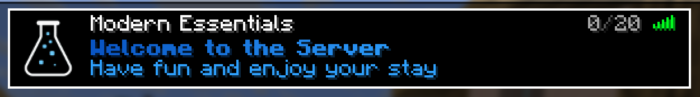
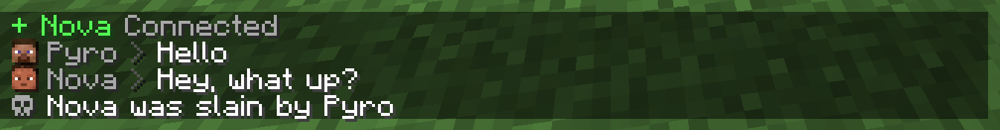
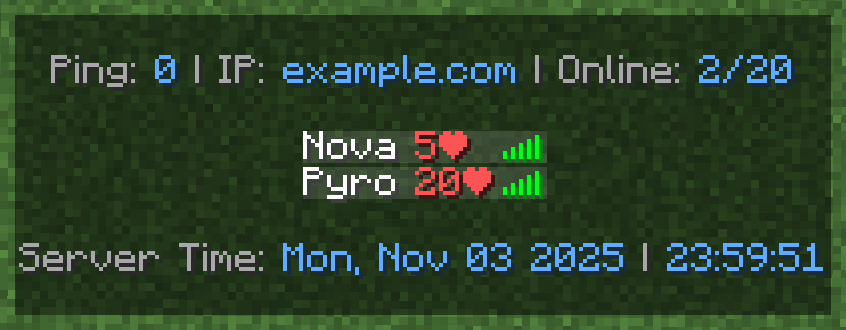

# Modern Essentials

**Modern Essentials** is a lightweight [Paper](https://papermc.io/software/paper) plugin that provides essential
commands and features.

---

## Features

- **Custom MOTD**
- **Customizable Tab List**
- **Custom Chat Formatting**
- **Custom Join and Quit Messages**
- **Custom Death Messages**
- **Custom Command Filter**

| MOTD                                | Chat                                | Tab List                          |
|-------------------------------------|-------------------------------------|-----------------------------------|
|  |  |  |

---

## Commands

| Command                                        | Description                                                                       | Permission                     |
|------------------------------------------------|-----------------------------------------------------------------------------------|--------------------------------|
| `/warp <name>`                                 | Teleport to the specified warp                                                    | `essentials.warp`              |
| `/setwarp <name>`                              | Create a new warp                                                                 | `essentials.setwarp`           |
| `/delwarp <name>`                              | Delete an existing warp                                                           | `essentials.delwarp`           |
| `/tpa <target>`                                | Send a teleport request to a player (requires `essentials.tpa.accept` permission) | `essentials.tpa`               |
| `/world <world>`                               | Teleport to another world                                                         | `essentials.world`             |
| `/jump`                                        | Jump to the nearest block in your line of sight                                   | `essentials.jump`              |
| `/top`                                         | Teleport to the highest block at your location                                    | `essentials.top`               |
| `/bottom`                                      | Teleport to the lowest safe block at your location                                | `essentials.bottom`            |
| `/fly`                                         | Toggle flight mode                                                                | `essentials.fly`               |
| `/god`                                         | Enable invincibility                                                              | `essentials.god`               |
| `/vanish`                                      | Become invisible to other players                                                 | `essentials.vanish`            |
| `/fullbright`                                  | Enable full-bright vision                                                         | `essentials.fullbright`        |
| `/speed <speed>`                               | Set walk speed                                                                    | `essentials.speed`             |
| `/flyspeed <speed>`                            | Set fly speed                                                                     | `essentials.flyspeed`          |
| `/nickname <nickname>`                         | Change your own nickname                                                          | `essentials.nickname`          |
| `/nickname <target> <nickname>`                | Change the target player's nickname                                               | `essentials.nickname.others`   |
| `/heal`                                        | Restore your health completely                                                    | `essentials.heal`              |
| `/heal <targets>`                              | Restore the target players' health completely                                     | `essentials.heal.others`       |
| `/feed`                                        | Restore your hunger completely                                                    | `essentials.feed`              |
| `/feed <targets>`                              | Restore the target players' hunger completely                                     | `essentials.feed.others`       |
| `/enderchest`                                  | Open your Ender Chest from anywhere                                               | `essentials.enderchest`        |
| `/enderchest <target>`                         | Open the target player's Ender Chests                                             | `essentials.enderchest.others` |
| `/inventorysee <target>`                       | View the target player's inventory                                                | `essentials.inventorysee`      |
| `/craftingtable`                               | Open a crafting table                                                             | `essentials.craftingtable`     |
| `/anvil`                                       | Open an anvil                                                                     | `essentials.anvil`             |
| `/cartographytable`                            | Open a cartographytable                                                           | `essentials.cartographytable`  |
| `/grindstone`                                  | Open a grindstone                                                                 | `essentials.grindstone`        |
| `/loom`                                        | Open a loom                                                                       | `essentials.loom`              |
| `/smithingtable`                               | Open a smithingtable                                                              | `essentials.smithingtable`     |
| `/stonecutter`                                 | Open a stonecutter                                                                | `essentials.stonecutter`       |
| `/repair hand\|all`                            | Repair the main-hand item or all items in your inventory                          | `essentials.repair`            |
| `/day\|night\|noon\|midnight\|sunrise\|sunset` | Set the time of day                                                               | `essentials.time`              |
| `/sun\|/rain\|/thunder`                        | Change the weather                                                                | `essentials.weather`           |
| `/kickall`                                     | Kick all other players from the server                                            | `essentials.kickall`           |
| `/mute <targets>`                              | Prevent the target players from chatting                                          | `essentials.mute`              |
| `/unmute <targets>`                            | Allow the target players to chat again                                            | `essentials.unmute`            |
| `/essentials reload\|version`                  | Reload config or check version                                                    | `essentials.reload`            |

---

## Placeholders

Modern Essentials supports [MiniPlaceholders](https://modrinth.com/plugin/miniplaceholders) but also has some built-in
placeholders

| Placeholder       | Description                                                                                 |
|-------------------|---------------------------------------------------------------------------------------------|
| `<online>`        | Current number of online players                                                            |
| `<online_max>`    | Maximum allowed players on the server                                                       |
| `<time:'format'>` | Current real-world time in your specified format, for example `'EEE, LLL dd yyyy HH:mm:ss'` |
| `<player>`        | Player's username                                                                           |
| `<displayname>`   | Player's display name (may include prefix/suffix)                                           |
| `<nickname>`      | Player's nickname or their username if no nickname is set                                   |
| `<player_head>`   | Player's head texture as a symbol                                                           |
| `<uuid>`          | Player's UUID                                                                               |
| `<ping>`          | Player's current ping                                                                       |
| `<world>`         | Name of the world the player is currently in                                                |
| `<health>`        | Player's current health                                                                     |

---
